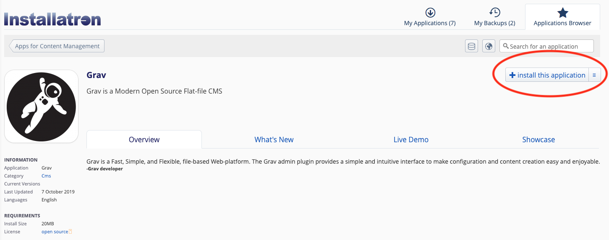
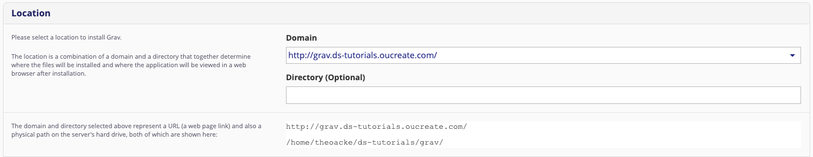
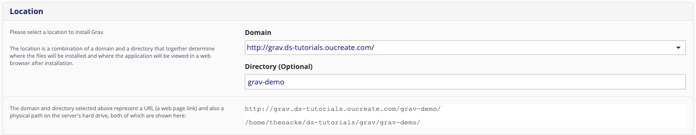
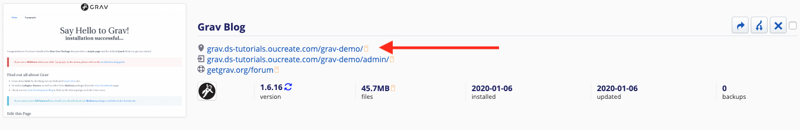
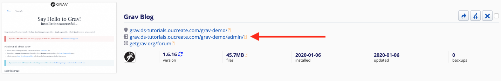

---

! Please note: This tutorial describes installing Grav using Reclaim Hosting, specifically through OU Create. If you are using this tutorial but wish to install Grav a different way, please refer to the [official documentation](https://learn.getgrav.org/16/basics/installation) for installation instructions.

## Set up your domain

If you are currently affiliated with OU, you have access to a free subdomain of oucreate.com through OU Create/Reclaim Hosting (or an inexpensive domain of your own). If you have not yet claimed this domain, please set it up now following the instructions [here](https://create.ou.edu/docs/getting-started/signing-up/).

## Install Grav

Once you have signed in to your dashboard on OU Create/Relcaim Hosting you will either see Grav listed under the Applications section or you can click on All Applications and find Grav from there.

While most of the default settings for the installation are fine, there are a few we want to change.

By default, the installation will want to put Grav in a folder (directory) called cms.

You can choose instead to install Grav directly in your home folder by leaving the field blank.

Or you can change the name of the folder. For this tutorial, we will name our folder grav-demo.

It is worth noting on the three screenshots above what the resulting URL is for each website. This is how you and visitors will access your site online.

We also need to set the website name, as well as our full name, email address, username, and password, as shown here.

Finally, the only other setting we might consider changing here is the skeleton package. The default, GravCor + Admin, is not bad, but depending on what we want to do, a skeleton package might make setting up the website easier. For this tutorial we will stick with the default, but you can get more information in the mini tutorial on skeletons.

All we need to do now is press install.

## Check out the admin panel

Familiarity with the admin panel is important, as this is where we will spend most of our time building our website. You can access the panel by going to `NOCLIP your-website-url/admin`. You will be directed to log in using the username and password you chose when installing Grav.

If you go to your grav application on the Reclaim Hosting/OU Create dashboard after installation, you will see links to access both your website and the admin panel. The first link will take you directly to your website.

The second link will take you to the admin panel.

When you click the link to the admin panel, you will be prompted to log in with the username and password you chose in the installation settings.

!!! The Grav documentation has a whole chapter dedicated to the [administration panel](https://learn.getgrav.org/16/admin-panel). It is worth skimming, at the very least.

Before we do anything else, we need to make sure that Grav is up-to-date. On your dashboard, click the _check for updates_ button.

In this case, I have to do two updates. First, Grav itself has been updated to a new version. It is essential to always keep Grav updated to the latest version to minimize potential errors.

When that update is complete, there are still normal updates required. Several of the packages (themes or plugins) that were automatically installed are not on the latest version. These updates are also important.

When that has finished, the dashboard will show that everything is up-to-date.

If you run into any issues using the admin panel, or just want to know more, you can check out the [documentation](https://learn.getgrav.org/16/admin-panel).