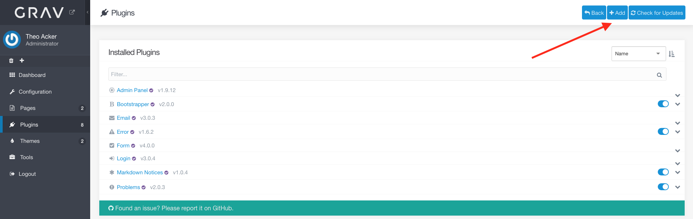
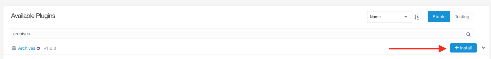

---

Themes and plugins are both very important. Every website has one theme, which defines how the site looks and feels. The theme may also interact with various plugins, such as by adding a search bar if the plugin _SimpleSearch_ is enabled. There are many available plugins, each of which add some type of functionality to your website. In fact, the admin panel we are using is actually a plugin itself.

! When going to add themes or plugins, if you get a message that you cannot connect to the gpm, you probably need to update Grav

## Themes

First, we need to choose a theme. To see a list of themes you can add, click on the _Add_ button at the top right of the Themes section on the admin panel.

!!! The **[Themes chapter](https://learn.getgrav.org/16/themes)** in the Grav documentation is very technical, but you may want to check out the section on themes in the **[Adminstration Panel chapter](https://learn.getgrav.org/16/admin-panel/themes)**.

There are a lot of available themes. If you click on one of them, you will see a variety of information including a linke to a Readme file, and possibly a link to a demo website. These are both worth examining if you are considering using that theme. [Skeletons](https://getgrav.org/downloads/skeletons) are a particularly helpful resource for understanding themes, although they do not exist for all available themes, as they provide sample pages for you to start out with. More information about working with skeletons can be found in the mini tutorials.

For this tutorial we will actually use the default theme, but if you decide to use a different theme at some point, this is where you will go.

Going back to the Themes tab, click on the Quark theme. Here you will see the information page for the theme. There is a link to the Readme file that contains some information about the theme, and just under it are a number of configuration options. These can modify certain aspects of the theme. For now, we will leave them as they are.

- screenshot

## Plugins

Some themes support certain plugins. Common suspects include Breadcrumbs, Pagination, SimpleSearch, Taxonomy List, and TNT Search. Ideally your chosen theme will have a detailed Readme that lists supported plugins. If it does not, I describe how to manually find out which plugins the theme uses in the mini tutorials. There are also many plugins that do not require theme support. The best way to find out how to use a plugin is to look through the provided Readme.

!!! The **[Plugins chapter](https://learn.getgrav.org/16/plugins)** in the Grav documentation is very technical, but you may want to check out the section on plugins in the **[Adminstration Panel chapter](https://learn.getgrav.org/16/admin-panel/plugins)**.

Unfortunately, while the Readme for Quark is very helpful, it does not describe what plugins it automatically supports. However, we will install several plugins that are commonly supported.

To start with, we will need to go to the _Plugins_ tab on the admin panel and the click the _Add_ button.

Since there are a lot of plugins, it is easiest to search for a plugin you know you want by typing in the name. We will start with the _Archives_ plugin.

When the installation has finished, the admin panel will take us to the information and configuration page for the plugin, just like it did when we installed the theme. Again, you will see both a link to the Readme for the plugin and the various configuration options available. Now we have to install the Breadcrumbs, Feed, Pagination, Random, Related Pages, SimpleSearch, and Taxonomy List plugins. These are installed exactly the same way that we installed Archives.

Those are quite a few plugins, especially if you are not sure what they do yet. One easy option for experimenting with how they affect the website and theme interactions is to toggle the plugins on and off. However, we will need to add content to the website before that does anything useful for us.
