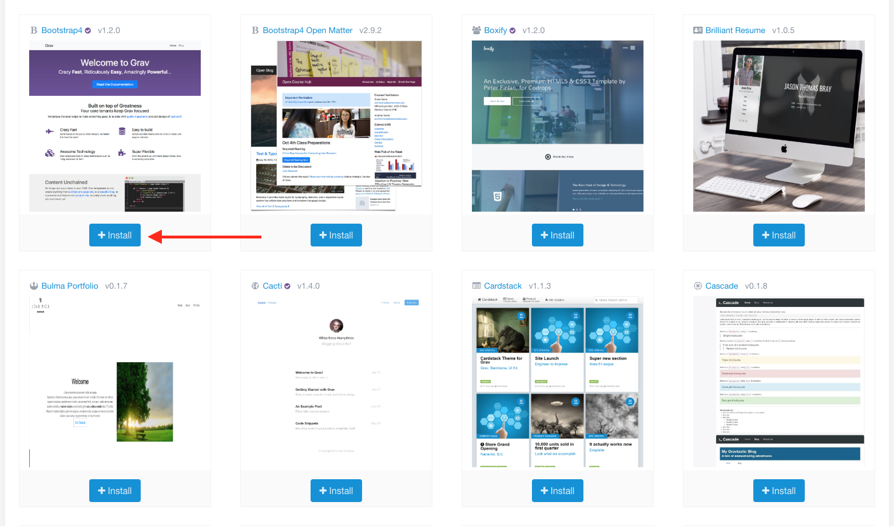
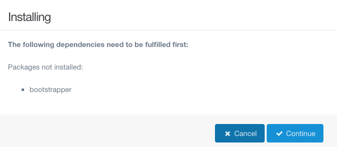
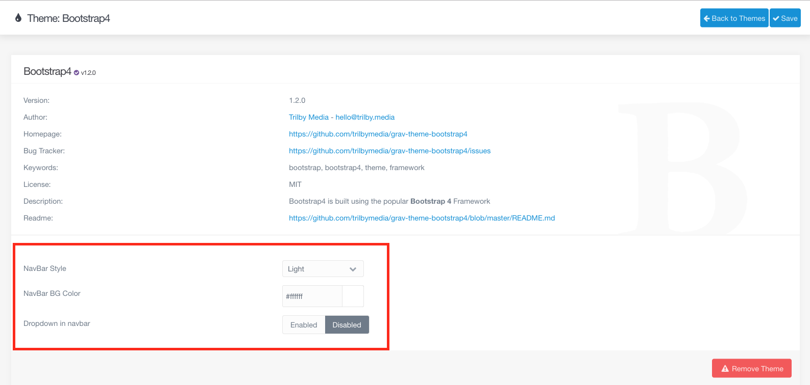
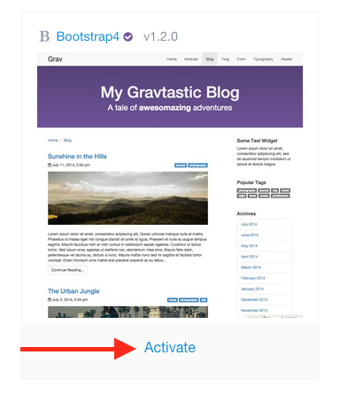
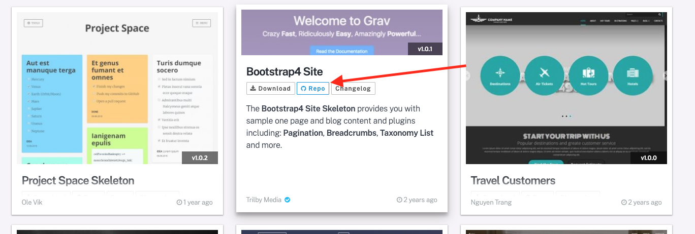

---

Themes and plugins are both very important. Every website has one theme, which defines how the site looks and feels. The theme may also interact with various plugins, such as by adding a search bar if the plugin _SimpleSearch_ is enabled. There are many available plugins, each of which add some type of functionality to your website. In fact, the admin panel we are using is actually a plugin itself.

! When going to add themes or plugins, if you get a message that you cannot connect to the gpm, you probably need to update Grav

## Themes

First, we need to choose a theme. To see a list of themes you can add, click on the _Add_ button at the top right of the Themes section on the admin panel.

!!! The **[Themes chapter](https://learn.getgrav.org/16/themes)** in the Grav documentation is very technical, but you may want to check out the section on themes in the **[Adminstration Panel chapter](https://learn.getgrav.org/16/admin-panel/themes)**.

There are a lot of available themes. If you click on one of them, you will see a variety of information including a linke to a Readme file, and possibly a link to a demo website. These are both worth examining if you are considering using that theme. [Skeletons](https://getgrav.org/downloads/skeletons) are a particularly helpful resource for understanding themes, although they do not exist for all available themes, as they provide sample pages for you to start out with. More information about working with skeletons can be found in the mini tutorials.

For this tutorial, we will be using the Bootstrap4 theme, so you can go ahead and click install when you find that theme.

Because Bootstrap4 requires the plugin _Bootstrapper_ to function properly, when you install the theme you will be prompted to install the dependency as well. This is a very helpful feature! There are other plugins that Bootstrap4 makes use of, but _Bootstrapper_ is the only one it absolutely requires.

Once the installation has finished, you will see the information page for the Bootstrap4 theme. Just under the link to the Readme are a few configuration options. These can modify certain aspects of the theme. For now, we will leave them as they are.

Grav does not automatically switch the theme we are using when we install a new theme, so now we need to activate Bootstrap4.

Because each theme defines the templates available to use for your website, activating a theme will always result in a warning prompt that templates you are currently using might not be supported. Of course, since we have not yet edited any of the content, we can ignore this completely.

## Plugins

Some themes support certain plugins. Common suspects include Breadcrumbs, Pagination, SimpleSearch, Taxonomy List, and TNT Search. Ideally your chosen theme will have a detailed Readme that lists supported plugins. If it does not, I describe how to manually find out which plugins the theme uses in the mini tutorials. There are also many plugins that do not require theme support. The best way to find out how to use a plugin is to look through the provided Readme.

!!! The **[Plugins chapter](https://learn.getgrav.org/16/plugins)** in the Grav documentation is very technical, but you may want to check out the section on plugins in the **[Adminstration Panel chapter](https://learn.getgrav.org/16/admin-panel/plugins)**.

Unfortunately the Readme for Bootstrap4 does not describe what plugins we can use. However, there is a skeleton package available for Bootstrap4, and this will tell us what plugins are needed to recreate the skeleton as shown. Skeletons can be found [here](https://getgrav.org/downloads/skeletons). There are a lot of skeletons available, but the only one we are interested in is the _Bootstrap4 Site_. Clicking on the _Repo_ button will take us to a Github repository that contains the skeleton and some documentation.

Since we are not currently going over how to use skeletons, the important thing to note is the documentation, specifically:

> NOTE: This skeleton is a modular component for Grav which requires Grav, the Admin, Archives, Bootstrapper, Breadcrumbs, Feed, Form, Login, Pagination, Random, Related Pages, Simple Search and Taxonomy List plugins, and a theme to be installed in order to operate. If you download this skeleton as part of a pre-assembled package from GetGrav.org, you should have everything you need to get started.

We already have Grav and the Bootstrap4 theme, of course. We also already have the Admin, Bootstrapper, Form, and Login plugins. The Bootstrapper plugin was installed as a dependency of the theme, and the others were installed automatically when we installed Grav. To install the others, we will need to go to the _Plugins_ tab on the admin panel and the click the _Add_ button.

Since there are a lot of plugins, it is easiest to search for a plugin you know you want by typing in the name. We will start with the _Archives_ plugin.

When the installation has finished, the admin panel will take us to the information and configuration page for the plugin, just like it did when we installed the theme. Again, you will see both a link to the Readme for the plugin and the various configuration options available. Now we have to install the Breadcrumbs, Feed, Pagination, Random, Related Pages, SimpleSearch, and Taxonomy List plugins. These are installed exactly the same way that we installed Archives.

Those are quite a few plugins, especially if you are not sure what they do yet. One easy option for experimenting with how they affect the website and theme interactions is to toggle the plugins on and off. However, we will need to add content to the website before that does anything useful for us.
