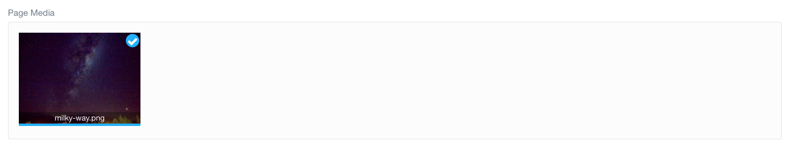

---

To add a blog page, first click the _Add_ button on the Pages tab.


We have to choose a title for our page, as well as what template to use. The folder name will automatically be constructed from the title and the other settings are good the way they are.


## The Page Editor

After you click the _Save_ button at the top right, the page editor will look like this.

- screenshot

1. **Title**. This is automatically filled with the title we chose. We can change it at any time if we want a different title.
2. **Markdown Editor**. This is where the content of the page goes. Grav uses markdown to format text. The Grav documentation includes a very handy [markdown reference](https://learn.getgrav.org/16/content/markdown). There are also markdown editors you can use instead if you prefer. I found that once I got used to markdown I had no problems with the built-in Grav editor, but a lot of this will come down to personal preference.
3. **Tabs**. All pages will have Content, Options, and Advanced tabs. Options and Advanced make it easy to change various settings for the page, although the defaults are often perfectly fine. Some pages will also have a special tab. For the _Blog_ page it is the Blog Config tab. We will take a closer look at this in a moment.
4. **Editor Mode**. By default, the content editor is in Normal mode. Putting it in expert mode will reduce the number of tabs and configurable options, but will allow us to directly edit the "frontmatter" of the page. Essentially, the frontmatter is a list of settings written in a special format at the top of the page. Using the normal editor mode obscures this by providing a user interface for setting these options. Occasionally, however, we may want to switch to expert mode in order to set an option that is not available in the user interface.
5. **Save Button**. This is the most important button on the page! Remember to save early and save often. You will also have noticed this button on the plugin and theme configuration pages. Any time we make a change, we need to save it by clicking this.
6. **Page Media**. This is where you can add media that you want to embed in your page.

## Adding Some Content

The blog page is not supposed to take a lot of content - really just a heading and subheading. In markdown, headings are denoted with the hashtag symbol. Type

```md
# My Example Blog

## Learning to use Grav
```


## Testing Expert Mode

After saving, we can take a look at the Blog Config tab.

- screenshot

There are a lot of options here. Fortunately, the default settings are usually pretty good, so all you need to do is glance over this tab for now. Some of the settings define the collection of blog posts. Some others provide settings for enabled plugins.

If we switch to expert mode, we can see how these settings are provided in the frontmatter. Although we will not have to edit them while in expert mode, this will help demystify the frontmatter, which may help in the future if we come across something we cannot modify from the provided user interface.

- screenshot of expert mode

Now we only have Content and Options tabs. On the Content tab, the Title section has been replaced with a Frontmatter section, which defines the title and some of the options we saw on the Blog Config page. You may notice (especially if you took a look at the Options and Advanced tabs) that not all of the settings are listed here. If a setting is not explicitly defined in the frontmatter, Grav will automatically use the default.

Since the normal editing mode will be much more useful to us in general, we can go ahead and switch back. If we navigate to our website, it should look like this:

- screenshot

## Adding Media

Markdown does have a format you can use to include images in your content. It looks like this:

```md

```

If the media has been added to the page that is using it, the url can simply be the name of the image. Like so:

```md

```

However, some templates will specifically make use of media that is added to the page. The Blog is one such template. At the moment, since no media has been added, the page content is displayed on a purple background. If we add an image, that image will be displayed instead. Since the text is white, we want to find a suitably dark image.

Before we do that, is is important to keep in mind that the resolution of an image can sometimes cause problems. We can prevent these problems by automatically resizing images when we add them. To do this, we will have to configure the Admin plugin.

After clicking on the Plugins tab and selecting the Admin plugin, there are a lot of configuration options listed. Scroll down to the Page Media Image Resizer section. There are two boxes we need to modify by replacing the 0 with 2048.


Click _Save_ and go back to the Blog page. At the bottom of the Content section there is a place for page media.


I used the image found [here](https://unsplash.com/photos/J4RIaAU8s2o), but if you have an image you would rather use, feel free.

Photo by 
<a style="background-color:black;color:white;text-decoration:none;padding:4px 6px;font-family:-apple-system, BlinkMacSystemFont, &quot;San Francisco&quot;, &quot;Helvetica Neue&quot;, Helvetica, Ubuntu, Roboto, Noto, &quot;Segoe UI&quot;, Arial, sans-serif;font-size:12px;font-weight:bold;line-height:1.2;display:inline-block;border-radius:3px" href="https://unsplash.com/@noaa?utm_medium=referral&amp;utm_campaign=photographer-credit&amp;utm_content=creditBadge" target="_blank" rel="noopener noreferrer" title="Download free do whatever you want high-resolution photos from NOAA"><span style="display:inline-block;padding:2px 3px"><svg xmlns="http://www.w3.org/2000/svg" style="height:12px;width:auto;position:relative;vertical-align:middle;top:-2px;fill:white" viewBox="0 0 32 32"><title>unsplash-logo</title><path d="M10 9V0h12v9H10zm12 5h10v18H0V14h10v9h12v-9z"></path></svg></span><span style="display:inline-block;padding:2px 3px">NOAA</span></a> on Unsplash.

When you have added and saved the image, your content editor will show it in the media box.



The page itself will also look a lot nicer.

- screenshot