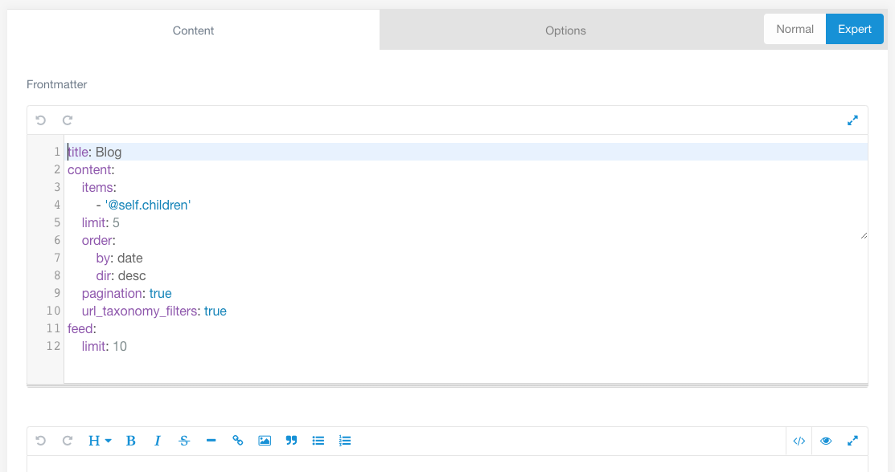

---

To add a blog page, first click the _Add_ button on the _Pages_ tab.


We have to choose a title for our page. I chose _Blog_ and the folder name automatically constructed itself as _blog_. We also have to set the template to use as the _Blog_ template. The other settings are good the way they are.


## The Page Editor

After you click the _Save_ button at the top right, the page editor will look like this.


1. **Title**. This is automatically filled with the title we chose. We can change it at any time if we want a different title.
2. **Markdown Editor**. This is where the content of the page goes. Grav uses markdown to format text. The Grav documentation includes a very handy [markdown reference](https://learn.getgrav.org/16/content/markdown). There are also markdown editors you can use instead if you prefer. I found that once I got used to markdown I had no problems with the built-in Grav editor, but a lot of this will come down to personal preference.
3. **Tabs**. All pages will have _Content_, _Options_, and _Advanced_ tabs. _Options_ and _Advanced_ make it easy to change various settings for the page, although the defaults are often perfectly fine. Some pages will also have a special tab. For the _Blog_ page it is the _Blog Config_ tab. We will take a closer look at this in a moment.
4. **Editor Mode**. By default, the content editor is in normal mode. Putting it in expert mode will reduce the number of tabs and configurable options, but will allow us to directly edit the "frontmatter" of the page. Essentially, the frontmatter is a list of settings written in a special format at the top of the page. Using the normal editor mode obscures this by providing a user interface for setting these options. Occasionally, however, we may want to switch to expert mode in order to set an option that is not available in the user interface.
5. **Save Button**. This is the most important button on the page! Remember to save early and save often. You will also have noticed this button on the plugin and theme configuration pages. Any time we make a change, we need to save it by clicking this button.
6. **Page Media**. This is where you can add media that you want to embed in your page.

## Adding Some Content

The blog page is not supposed to take a lot of content. A heading and subheading is all it really needs. In markdown, headings are denoted with the hashtag symbol. Type

```md
# My Example Blog

## Learning to use Grav
```


This will render as


## Testing Expert Mode

After saving, we can take a look at the _Blog Config_ tab.


There are a lot of options here. Fortunately, the default settings are usually good to start out with, so all you need to do is glance over this tab for now. Some of the settings define the collection of blog posts. Some others provide settings for enabled plugins.

If we switch to expert mode, we can see how these settings are provided in the frontmatter. Although we will not have to edit them while in expert mode, this will help demystify the frontmatter, which may help in the future if we come across something we cannot modify from the provided user interface.



Now we only have _Content_ and _Options_ tabs. On the _Content_ tab, the _Title_ section has been replaced with a _Frontmatter_ section, which defines the title and some of the options we saw on the _Blog Config_ tab. You may notice (especially if you took a look at the Options and Advanced tabs) that not all of the settings are listed here. If a setting is not explicitly defined in the frontmatter, Grav will automatically use the default.

Since the normal editing mode will be much more useful to us in general, we can go ahead and switch back. If we navigate to our website, it should look like this:


## Adding Media

Markdown does have a format you can use to include images in your content. It looks like this:

```md

```

If the media has been added to the page that is using it, the url can simply be the name of the image. Like so:

```md

```

However, some templates will specifically make use of media that is added to the page. _Blog_ is one such template. At the moment, since no media has been added, the page content is displayed on a blank background. If we add an image, that image will be displayed instead.

Before we do that, is is important to keep in mind that the resolution of an image can sometimes cause problems, especially when working with the admin panel. We can prevent these problems by automatically resizing images when we add them. To do this, we will have to configure the _Admin_ plugin.

After clicking on the _Plugins_ tab and selecting the _Admin_ plugin, scroll through the listed configuration options to the _Page Media Image Resizer_ section. There are two boxes we need to modify by replacing the 0 with 2048.


Click _Save_ and go back to the _Blog_ page. At the bottom of the _Content_ section there is a place for page media.


<!--The images I use for this tutorial can be found here: TODO - link
Credit: W. Acker
Link to specific image used here?-->

When you have added and saved an image, your content editor will show it in the media box.


Since the image I chose is rather dark, it doesn't make sense to pair it with dark text. Fortunately, if we go back to the Blog Config tab, there is a Hero Section which deals with this type of image and text combination. If you chose a dark picture like I did, you will want to do add the Hero Class _text-light_ as well.


The page now looks a lot nicer.

