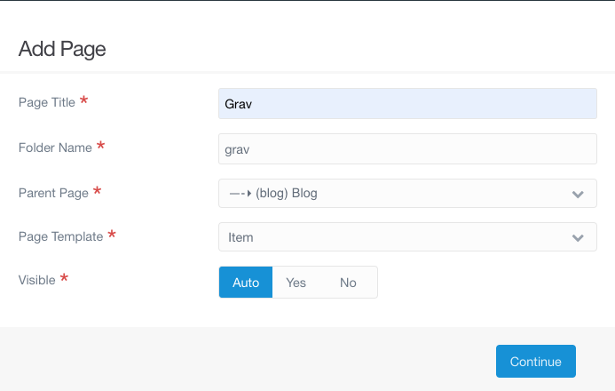
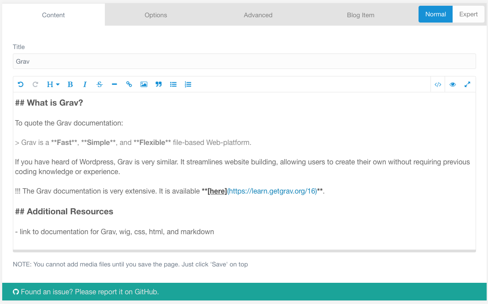
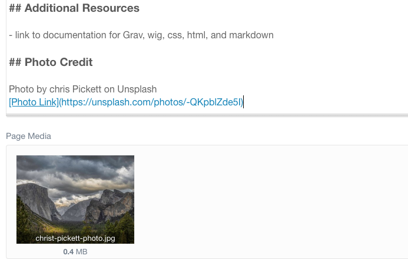
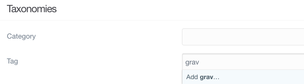
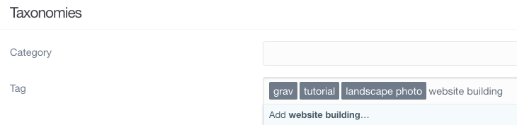
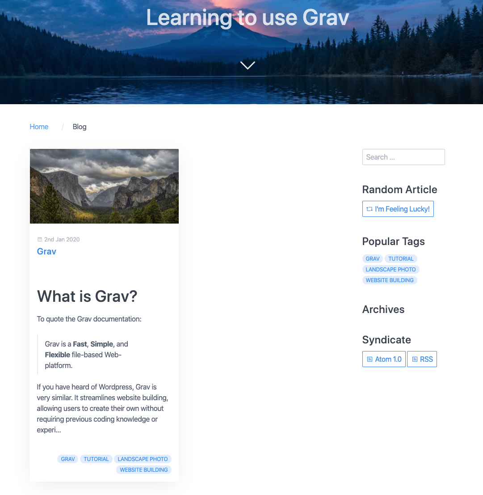
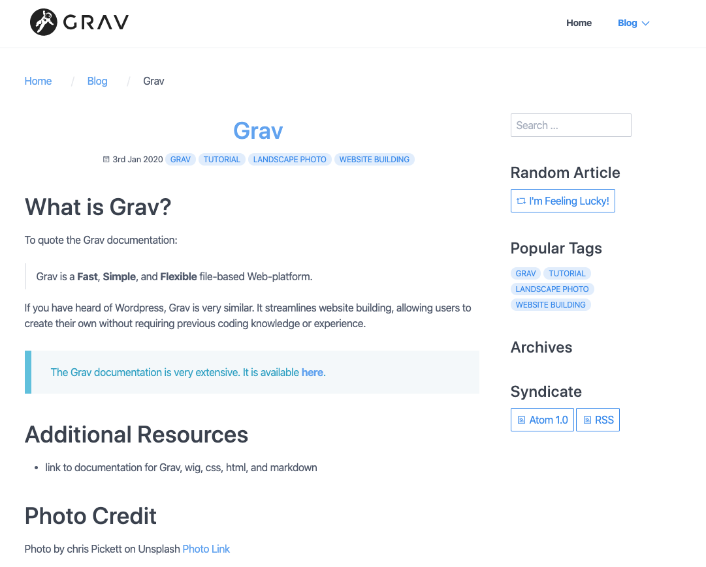

---

- Not a blog without blog items!
- Can add a blog item much the same way we added a blog page



- template is Item now, not Blog
- paret shouldn't be the root folder, but the Blog page we just made

- add some content to the item
- I just took this from the tutorial
- It provides some markdown examples with links, lists, quotes, and notices



- We should also add a picture to the post
- This picture came from Unsplash, as well (hopefully will be replaced by photos that Mom took)
- We should always include credit for photos we use, even those whose license does not require attribution.



- Finally, we should add some tags so people can easily see what the post is about and search/filter for posts by tag.
- The tag taxonomy is supported by Grav by default
- Tag display is supported by certain theme templates, searching/filtering on tags is supported by the Taxonomy List plugin
- Tags are added in the page editor Options tab
- This adds them to the frontmatter of the page in question. You can also add them directly to the frontmatter yourself
- First we start typing in a tag



- Pressing return creates the tag.
- We can add as many tags as we want



- This is what the frontmatter (yaml) for the tags looks like:

```yaml
taxonomy:
    tag:
        - grav
        - tutorial
        - 'landscape photo'
        - 'website building'
```

- Now we can take a look at our webpage



While the image shows up on the blog page, if we click on the post itself, the image is no longer there.

