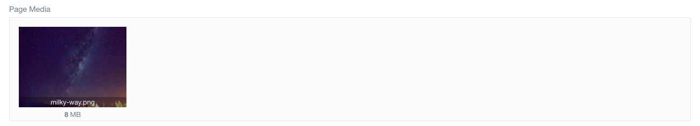
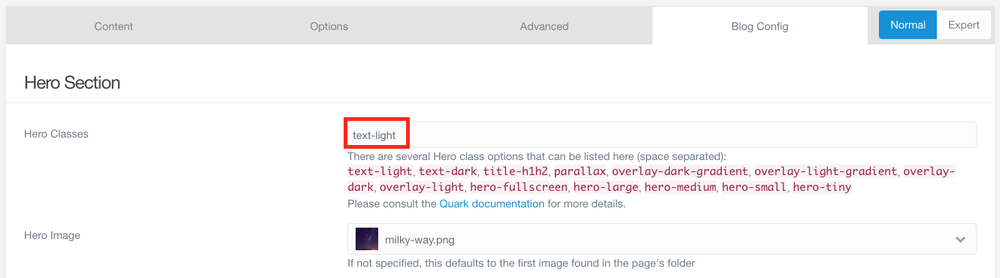
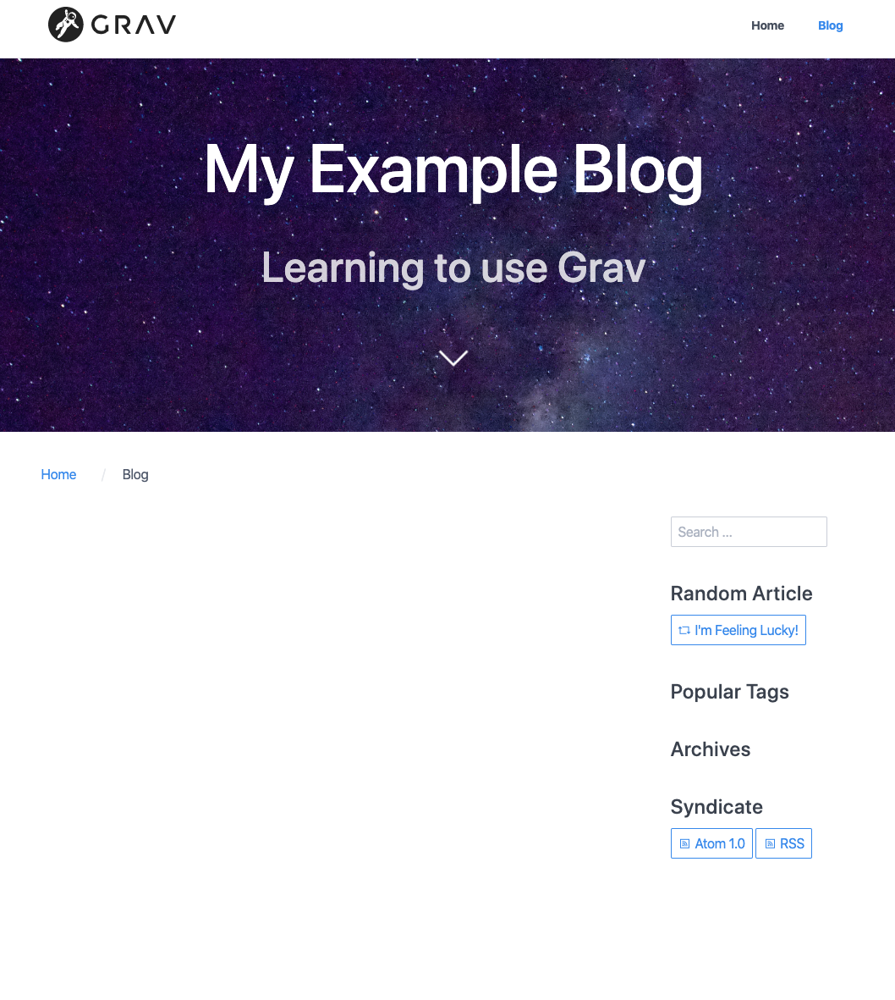
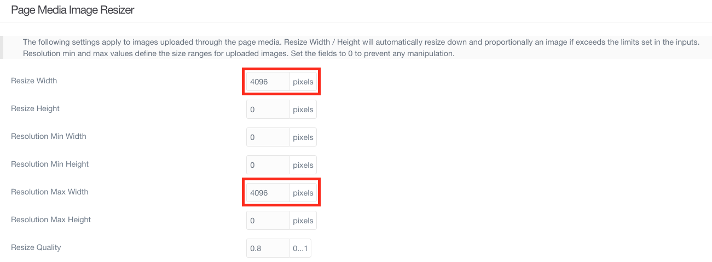

---

There are two main ways you can add images to your pages. The first is to include an image directly in your content. We will do this in one of our blog posts.

The other way is to add media to a page with a template that supports showing media. _Blog_ is one such template. At the moment, since no media has been added, the page content (the header and sub-header we added) is displayed on a blank background. If we add an image to the page, that image will become the background instead.

## Media Used in This Tutorial

The photos I use in this tutorial are available from [Flickr](https://www.flickr.com/photos/53807750@N08/with/49346925923/). You are welcome to download and use these for the tutorial.

## Adding Images

Whether we are including an image within our content as we will do later or adding an image to be used by the page template, we first have to add the image to the page itself. On the _Blog_ page, at the bottom of the _Content_ tab, there is a place to add media.


When we have added and saved an image, the content editor will show it in the media box.



Since the image I chose is rather dark, it does not make sense to pair it with dark text. Fortunately, if we go back to the _Blog Config_ tab there is a Hero Section which deals with this type of image and text combination. If you chose a dark picture like I did, you will want to do add the Hero Class _text-light_ as well. We can also explicitly set the image we added as the hero image to be used by the template, although it should automatically use the first image it finds.



The page now looks a lot nicer.



<!--

Not sure if this should be included or not.

## Admin Panel Image Issues

If you are able to add an image, but find that it is not showing up in the admin panel, it may be because the image is too large/high-resolution. If you encounter this issue, you can prevent these problems by automatically resizing the images when you add them. To do this, you will have to configure the _Admin_ plugin.

After clicking on the _Plugins_ tab and selecting the _Admin_ plugin, scroll through the listed configuration options to the _Page Media Image Resizer_ section. There are two boxes we need to modify by replacing the 0 with another number. The first box, _Resize Width_ tells the admin panel what width to use when resizing images. The number you put will define the number of pixels in the width. In the example I have chosen the number 4096, but if you still encounter problems you should find 2048 to still provide a very good image. The second box, _Resolution Max Width_ tells the admin panel to resize any images with a higher width than the number provided. Keep in mind, this is width in pixels and does not affect the size of the image displayed. We can also assign numbers to _Resize Height_ and _Resolution Max Height_, but since images will be resized proportionally, this should not be necessary.



Remember to click _Save_ when you are finished! -->


Markdown does have a format you can use to include images in your content. It looks like this:

```md

```

If the media has been added to the page that is using it, the url can simply be the name of the image. Like so:

```md

```
