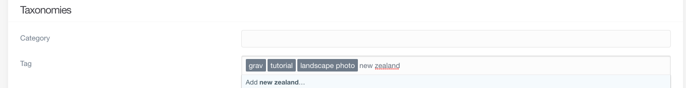
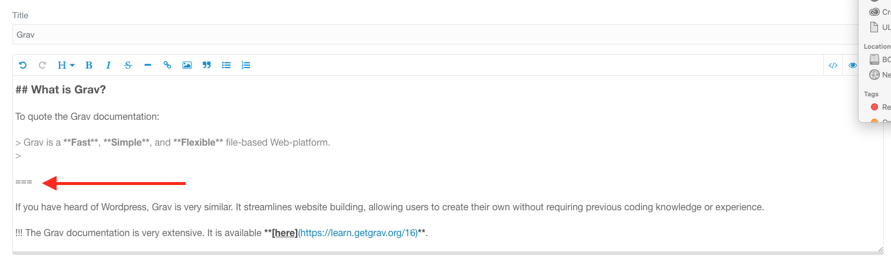

---

No blog would be complete without posts. The template for a blog post is the _Blog Item_ template. We can create a new page for our post the same way we added a blog page.


- template is Item now, not Blog
- paret shouldn't be the root folder, but the Blog page we just made

- add some content to the item
- I just took this from the tutorial
- It provides some markdown examples with links, lists, quotes, and notices


- We should also add a picture to the post
- This picture came from Unsplash, as well (hopefully will be replaced by photos that Mom took)
- We should always include credit for photos we use, even those whose license does not require attribution.


- Finally, we should add some tags so people can easily see what the post is about and search/filter for posts by tag.
- The tag taxonomy is supported by Grav by default
- Tag display is supported by certain theme templates, searching/filtering on tags is supported by the Taxonomy List plugin
- Tags are added in the page editor Options tab
- This adds them to the frontmatter of the page in question. You can also add them directly to the frontmatter yourself
- First we start typing in a tag


- Pressing return creates the tag.
- We can add as many tags as we want



- This is what the frontmatter (yaml) for the tags looks like:

```yaml
taxonomy:
    tag:
        - grav
        - tutorial
        - 'landscape photo'
        - 'website building'
```

- Now we can take a look at our webpage


- While the image shows up on the blog page, if we click on the post itself, the image is no longer there.


- If we go to our page editor, we can see that if a hero image is not set, it should default to the first image in the page's media.
- It seems odd that it is not showing up, but this the reality is that when working with technology, you will often encounter odd-seeming situations. That is okay. We will try explicitly setting the hero image to see if that fixes the issue.


- Now when we click on the post (or refresh the page) the image shows up


- One other issue is that, on the blog page, the item card is very long. By default, Grav determines a certain summary size and displays that on the blog page.
- We can change this in several ways, but the most useful/versatile way is by including a summary delimiter `NOCLIP ===` in the page content.
- This will tell Grav to end the summary at this point.
- The summary delimiter will not show up in the actual page content, just in the editor.



- Now we can check the blog page
- The card is much shorter, as the summary ends as soon as it reaches the delimiter


- In the navigation, the page can be seen in the dropdown for Blog.
- This is not ideal, particularly when you consider how many posts you might want to add.
- In the Advanced tab, we can set Visible to Disabled.
- Now the post is hidden. We can do this for all the posts we add.
- You can also set this option when you create a new post
- Although does setting a new post to not be visible also disable numeric prefixes?
- But maybe could show by date instead of prefixes

- screenshot

- We have successfully added our first blog item!
- We should add several more posts to see how the blog looks when it is populated

- include screenshots