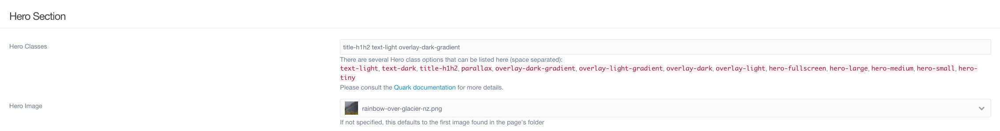
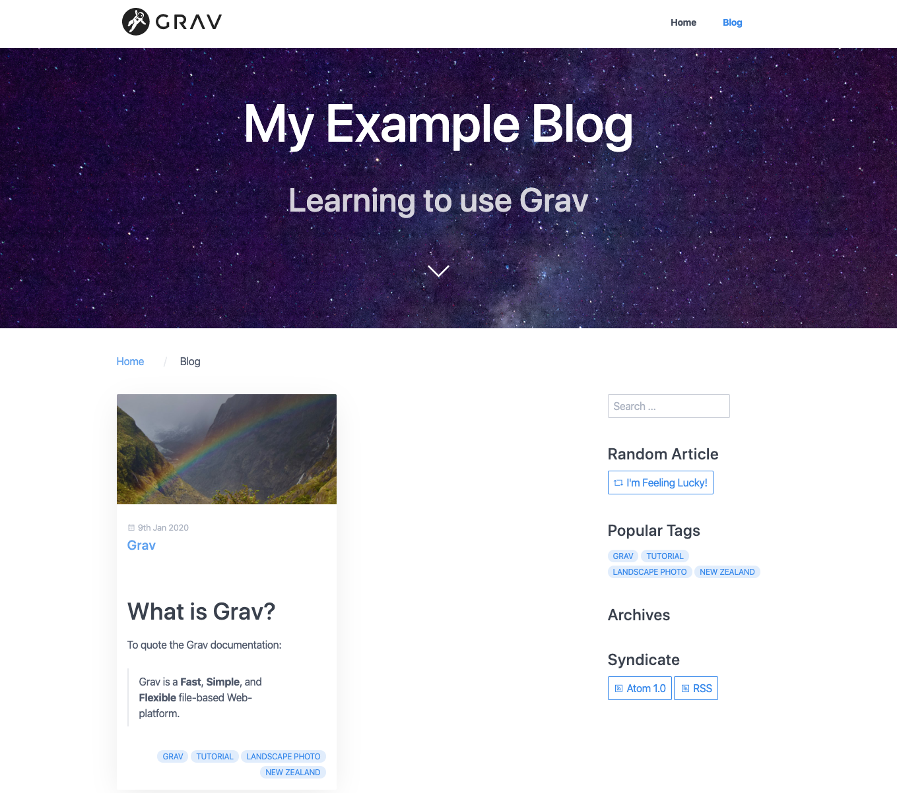

---

## Adding the Page

No blog would be complete without posts. The template for a blog post is the _Item_ template. We can create a new page for our post the same way we added a blog page.


I decided to name the first post _Grav_ since we are talking about how to use Grav. As before, the folder name is automatically generated, but this time we need to change the parent page from `NOCLIP \ (root)` to `NOCLIP (blog) Blog`. If we added the page to the root of our website it would show up as another page like _Home_ and _Typography_. Adding it to _Blog_ makes it a sub-page of that page, and because the _Blog_ template references a collection of its children (sub-pages), our new page will be displayed on our blog.

We also need to change the page template from _Blog_ to _Item_ and to set the page not to be visible. Visibility determines whether or not the page is displayed in the navigation. If we set the post to be visible, then mousing over the word _Blog_ in our navigation bar will display a dropdown menu we can use to access the page.


The dropdown seems relatively unobtrusive with just the one post, but if we continue adding posts it will quickly grow out of hand. Instead, we want to access our pages through the main blog page. Making the page invisible will not prevent it from showing up there.

## Adding Content

Since the title of our first post is _Grav_, we should probably write something about Grav in the content. We can start by using the markdown syntax for a header.

```md
## What is Grav?

```

Then we can answer our question with some information from the [Grav page](http://grav.ds-tutorials.oucreate.com/overview/grav) in this tutorial. Markdown quotes are written using the `NOCLIP >` symbol.

```md
To quote the Grav documentation:

> Grav is a **Fast**, **Simple**, and **Flexible** file-based Web-platform.
> 

If you have heard of Wordpress, Grav is very similar. It streamlines website building, allowing users to create their own without requiring previous coding knowledge or experience.

```

To add the fancy blue box with the link to the Grav documentation we can make use of the _Markdown Notices_ plugin that was automatically added when we installed Grav. There are yellow, red, blue, and green notices. The color/type of notice is determined by the number of exclamation points we put before it. Since blue is the third color, we need to use three exclamation points.

```md
!!! The Grav documentation is very extensive. It is available **[here](https://learn.getgrav.org/16?target=_blank)**.

```

The link at the end is enclosed with asterisks `NOCLIP **` so that it will be displayed with bold text to make it stand out better. The link format is `NOCLIP [text-to-display](url)`. In the link we are adding above, however, the url is `NOCLIP https://learn.getgrav.org/16` - `NOCLIP ?target=_blank` is there to tell browsers to open this link in a new page. This way readers can check out the Grav documentation without leaving the website.

This what the editor will look like when we have added the content above.


## Media

Like _Blog_, the _Item_ template supports adding an image as a header.

- We should also add a picture to the post
- This picture came from Unsplash, as well (hopefully will be replaced by photos that Mom took)
- We should always include credit for photos we use, even those whose license does not require attribution.


- Finally, we should add some tags so people can easily see what the post is about and search/filter for posts by tag.
- The tag taxonomy is supported by Grav by default
- Tag display is supported by certain theme templates, searching/filtering on tags is supported by the Taxonomy List plugin
- Tags are added in the page editor Options tab
- This adds them to the frontmatter of the page in question. You can also add them directly to the frontmatter yourself
- First we start typing in a tag


- Pressing return creates the tag.
- We can add as many tags as we want


- This is what the frontmatter (yaml) for the tags looks like:

```yaml
taxonomy:
    tag:
        - grav
        - tutorial
        - 'landscape photo'
        - 'website building'
```

- Now we can take a look at our webpage


- While the image shows up on the blog page, if we click on the post itself, the image is no longer there.


- If we go to our page editor, we can see that if a hero image is not set, it should default to the first image in the page's media.
- It seems odd that it is not showing up, but this the reality is that when working with technology, you will often encounter odd-seeming situations. That is okay. We will try explicitly setting the hero image to see if that fixes the issue.



- Now when we click on the post (or refresh the page) the image shows up


- One other issue is that, on the blog page, the item card is very long. By default, Grav determines a certain summary size and displays that on the blog page.
- We can change this in several ways, but the most useful/versatile way is by including a summary delimiter `NOCLIP ===` in the page content.
- This will tell Grav to end the summary at this point.
- The summary delimiter will not show up in the actual page content, just in the editor.


- Now we can check the blog page
- The card is much shorter, as the summary ends as soon as it reaches the delimiter



- In the navigation, the page can be seen in the dropdown for Blog.
- This is not ideal, particularly when you consider how many posts you might want to add.
- In the Advanced tab, we can set Visible to Disabled.
- Now the post is hidden. We can do this for all the posts we add.
- You can also set this option when you create a new post
- Although does setting a new post to not be visible also disable numeric prefixes?
- But maybe could show by date instead of prefixes

- screenshot

- We have successfully added our first blog item!
- We should add several more posts to see how the blog looks when it is populated

- include screenshots