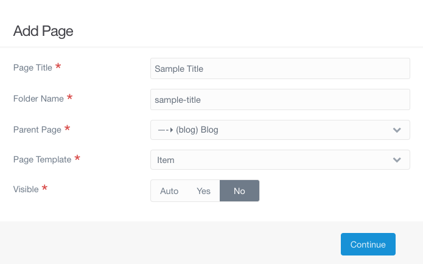

---

We should add several more posts to our blog so we can see how it will look when it is all put together.

You can make your own posts if you like, but I have provided several sample posts that you can use as well. You can follow along on this page to make each of these posts, <!-- or you can hopefully access a repository with my pages in it and add them using the file manager -->

## The Posts

Remember for each of these to use the _Item_ template, to not make the page visible, and to set the parent page to _(blog) Blog_, as below.



#### Media in Markdown

Title: `Media in Markdown`

Content:

```md
As mentioned in the [tutorial](http://grav.ds-tutorials.oucreate.com/base-tutorial/content/media), there are two ways to add images to your pages. The tutorial walks you through uploading an image and then setting it as the "hero image" used by the page template. However, if you just want to stick an image into a post, you can do that as well.

===

This is a photo from the 2017 total solar eclipse, taken in Casper, Wyoming. The moon has covered a substantial portion of the sun, but totality has not yet been achieved. As an aside, if you ever have the opportunity to see a total eclipse, take it! The partial stages were interesting, even exciting, but totality is something else.


Total Solar Eclipse 2017, Wyoming by [Wendy Acker](https://www.flickr.com/people/theodwynn/), [CC BY-NS-SA 4.0](https://creativecommons.org/licenses/by-nc-sa/4.0/)

The Markdown for adding an image looks like ``

If the media has been added to the page that is using it (by uploading it the same way you would before setting it as the hero image), the url can simply be the name of the image, like this: ``

Note that for this post, there is only one piece of media added. The blog page displays the image on the summary, but the post page does not show the image as a header/hero. If you do not want to use a header image, but still want to show an image with your post, this is an excellent way to do so.
```
Media: Total Solar Eclipse 2017, Wyoming

Tags: tutorial, markdown, astronomy

```yaml
taxonomy:
    tag:
        - tutorial
        - markdown
        - astronomy
```

Hero Image: none