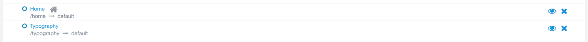
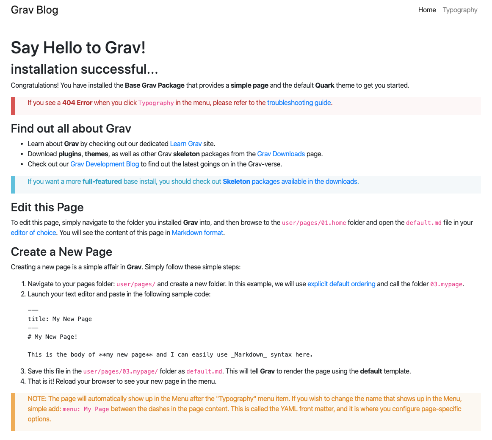
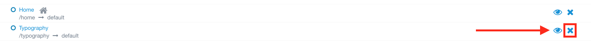

---

Content will be added through the Pages tab on the admin panel. The Grav installation starts us out with two default pages: Home and Typography.

If we open a new tab showing our website, we can see that the default looks pretty boring.

To start, we will remove the Typography page on the admin panel using the blue X. We will replace the home page in the mini tutorial about modular pages.

