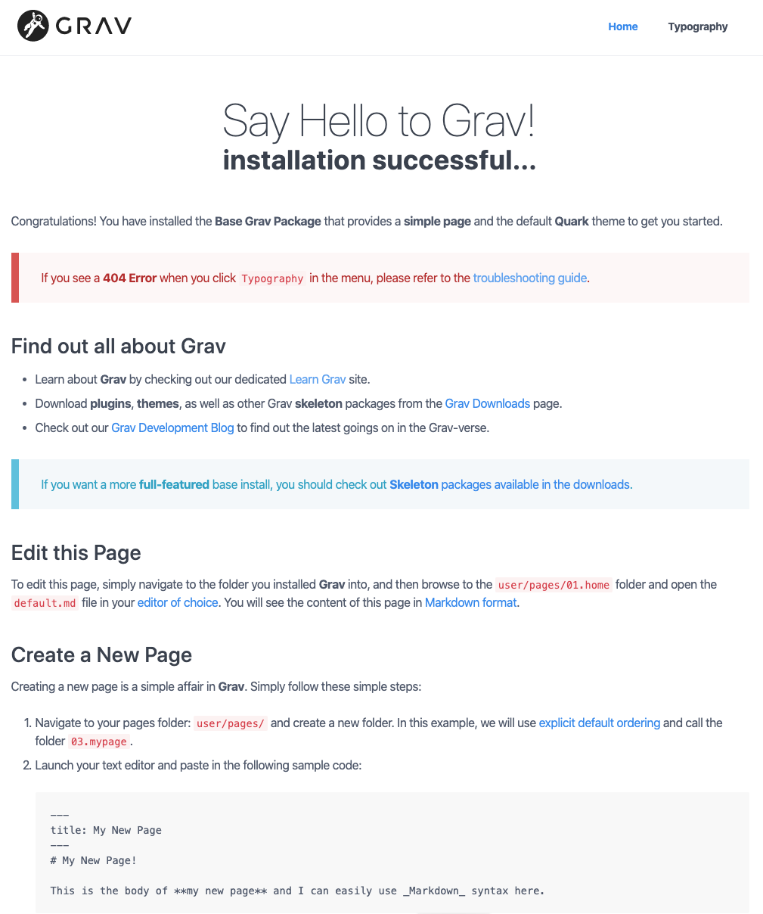

---

Content will be added through the _Pages_ tab on the admin panel. The Grav installation starts us out with two default pages: _Home_ and _Typography_.

If we open a new tab showing our website, we can see that the default looks pretty boring.

[ui-browser address="http://grav.ds-tutorials.oucreate.com/grav-demo/blog"]

[/ui-browser]

To start, we will remove the _Typography_ page on the admin panel using the blue X. We will replace the home page in the [mini tutorial](http://grav.ds-tutorials.oucreate.com/mini-tutorials/modular-pages) about modular pages.

